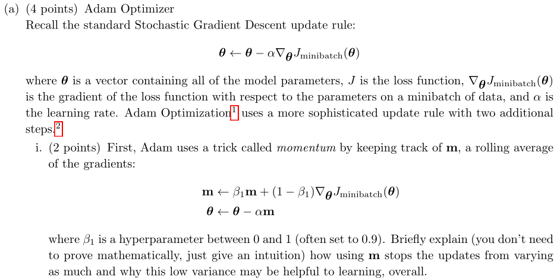
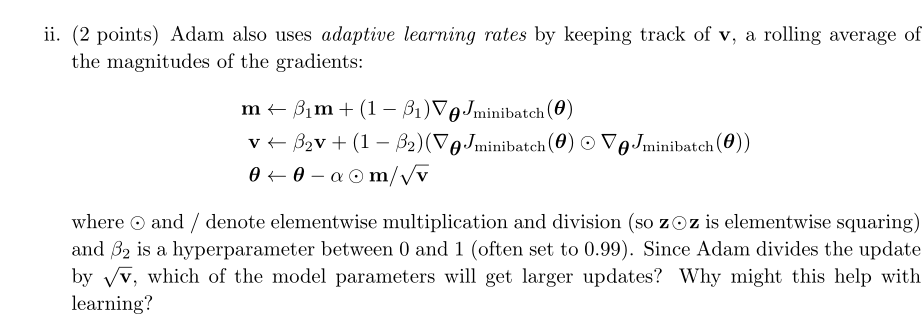
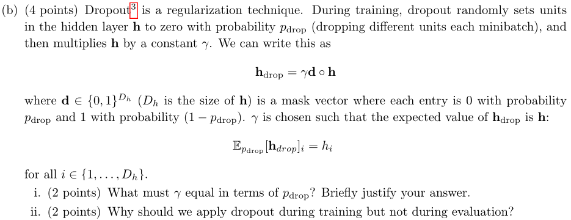

# Assignment 3 [written]

This trick uses the exponential weighted average, the $m$ calculated by this formula is approximately equal to $\frac{1}{1-\beta_1}gradient$. Simple derivation:
$$
m_{n}=\sum_{i=0}^{n}0.1\times0.9^i\times gradient_{n-i}
$$
The newer the gradient, the greater the proportion. We now that the gradient obtained each time is not always in the direction of the optimal value, however if it is decomposed, a large part of the gradient is towards the optimal value. If we directly use the gradient obtained each step, the optimization process will be very tortuous and fluctuate all the time. If several gradients obtained in the past are averaged, the components in other directions will be offset, and the components towards the optimal value will be larger and the update speed will be faster.

According to the formula, we can know that the final update is divided by $\sqrt v$. Therefore, the smaller the $\sqrt v$, the bigger the update step. $v$ is obtained by the exponential weighted average of the square of gradient, so the parameter with smaller gradient will get smaller $v$ value, which will get larger update. On the contrary, the parameters with larger gradient will get smaller update.

1. $h_{drop}=\gamma(1-p_{drop})\circ h$, so $\gamma=\frac1{1-p_{drop}}$

2. Dropout is a regularization technique. We use dropout in training to avoid over fitting and make the model more generalized.